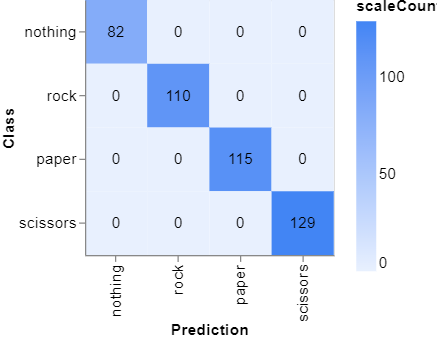

# **Rock Paper Scissors Game using Computer Vision**
The "Rock Paper Scissors" game is a classic game that has been enjoyed by people of all ages for generations. In this project, we have developed a Python program that allows you to play this game against a computer using a webcam. The game utilises computer vision to recognise your hand gestures. This is done by using OpenCV library to capture the video frames from your webcam, and then pre-process them to feed into a pre-trained image classification model developed using [Teachable-machine](https://teachablemachine.withgoogle.com/). The computer's choice is randomly selected, and the winner is determined according to the rules of the game.
## Prerequisites
* Python 3.x
* OpenCV2 
* Keras
* Numpy
* Camera

## How to Play
To play, follow these steps:

1) Clone this repository onto your local machine

    ```bash
    git clone https://github.com/TyW-98/rock-paper-scissors.git
    cd rock-paper-scissors
    ```

2) Install dependencies using configuration file

    ```console
    conda create --name env_name python=3.8
    conda activate env_name
    pip install -r requirements.txt
    ```
3) The following files should be present in the same directory as the code:
    * Keras_model.h5 (pre-trained Keras image classification model)
    * labels.txt (text file containing the labels for the image classes)

4) Run the game

    ```console
    python rps_class.py
    ```

5) The program will begin by showing you the live camera feed and count down from 15 seconds. Position your hand to show either rock,paper or scissors to the camera.
6) When the timer reaches 0, the program will take a pictyure of your hand and determine whether you showed rock, paper or scissors.
7) The program will then display the computer's choice and tell you whether you won, lost or tied the game.
8) The program will round for best of 3 rounds before asking if you would like to play again or not. If you wouldn't like to play again the program will terminate.

## rps_clss.py 
```python
import random
import cv2
from Keras.models import load_model
import numpy as np
import time

class rps:
    
    def __init__(self,):
        self.computer_score = 0
        self.user_score = 0
        self.times_up = -10.1
        self.cap = cv2.VideoCapture(0)
        self.model = load_model("Keras_model.h5")
        
        self.play()
        
    def get_computer_choice(self):
        self.comp_choice = random.choice(["rock","paper","scissors"])
        return self.comp_choice
    
    def get_prediction(self):
        data = np.ndarray(shape=(1, 224, 224, 3), dtype=np.float32)
        time_added = 15
        current_time = time.time()
        end_time = time.time() + time_added
        font = cv2.FONT_HERSHEY_COMPLEX
        text_x_loc = int((self.cap.get(cv2.CAP_PROP_FRAME_WIDTH)/2)-70)
        text_y_loc = int(self.cap.get(cv2.CAP_PROP_FRAME_HEIGHT)/2)
        
        while True:
            ret, frame = self.cap.read()
            current_time = time.time()
            cv2.putText(frame,f"User : Computer",(20,17),font,0.45,(255,153,0),1)
            cv2.putText(frame,f" {self.user_score}  :  {self.computer_score} ",(15,40),font,0.75,(255,153,0),2)
            if end_time - current_time >= time_added - 2 and end_time - current_time >= time_added/2:
                cv2.putText(frame, "Start", (text_x_loc,text_y_loc),font,2,(51, 204, 51),2)
            elif end_time - current_time <= time_added/3 and end_time - current_time >= 0.9:
                cv2.putText(frame, str(round(end_time - current_time,0)),(text_x_loc,text_y_loc), font, 2, (0,0,255),2)
            elif end_time - current_time <= 0.9 and end_time - current_time > 0:
                cv2.putText(frame,"Shoot",(text_x_loc,text_y_loc), font, 2, (0,0,255),2)
            elif end_time - current_time > 0 and end_time - current_time >= time_added/3:
                cv2.putText(frame, str(round(end_time - current_time,0)), (text_x_loc,text_y_loc),font,2,(51, 153, 255),2)

            if end_time - current_time <= 0.05 and end_time - current_time > -0.05:
                resized_frame = cv2.resize(frame,(224,224), interpolation = cv2.INTER_AREA)
                image_np = np.array(resized_frame)
                normalized_image = (image_np.astype(np.float32)/ 127) - 1
                data[0] = normalized_image
                prediction = self.model.predict(data)
                if np.argmax(prediction) == 0 :
                    self.user_choice = "nothing"
                elif np.argmax(prediction) == 1:
                    self.user_choice = "rock"
                elif np.argmax(prediction) == 2:
                    self.user_choice = "paper"
                else:
                    self.user_choice = "scissors"
                    
                print(prediction)
                print(self.user_choice)
                       
                self.get_winner()
                
            elif end_time - current_time <= self.times_up or cv2.waitKey(1) & 0xFF == ord("q"):
                break
            elif end_time - current_time <= -0.05 and end_time - current_time >= -5:
                cv2.putText(frame,f"you choose {self.user_choice} and computer choose {self.comp_choice}",(text_x_loc-150,text_y_loc),font,0.55,(153,153,255),1)
            elif end_time - current_time <= -5 and end_time - current_time >= self.times_up-0.1:
                if self.user_wins == 1 and self.computer_wins == 1:
                    cv2.putText(frame,"You did not show anything",(text_x_loc-140,text_y_loc),font,1,(204,51,0),1)
                elif self.user_wins == 1:
                    cv2.putText(frame,"You won this round",(text_x_loc-100,text_y_loc),font,1,(204,51,0),1)
                elif self.user_wins == 0 and self.computer_wins == 0:
                    cv2.putText(frame,"It is a draw",(text_x_loc-50,text_y_loc),font,1,(204,51,0),1)
                else:
                    cv2.putText(frame,"You lost this round",(text_x_loc-100,text_y_loc),font,1,(204,51,0),1)
                
            cv2.imshow("Rock Paper Scissors Game", frame)
                
    def get_winner(self):
        
        self.user_wins = 0
        self.computer_wins = 0
        
        if self.user_choice == "scissors" and self.comp_choice == "paper":
            print("YOU WON!")
            self.user_wins += 1
        elif self.user_choice == "rock" and self.comp_choice == "scissors":
            print("YOU WON!")
            self.user_wins += 1
        elif self.user_choice == "paper" and self.comp_choice == "rock":
            print("YOU WON!")
            self.user_wins += 1
        elif self.user_choice == self.comp_choice :
            print("IT IS A TIE!")
        elif self.user_choice == "nothing":
            print("No user input detected by the camera")
            self.user_wins += 1
            self.computer_wins += 1
        else:
            print("YOU LOST!")
            self.computer_wins += 1
            
    def play(self):
        
        while True:
            self.get_computer_choice()
            self.get_prediction()
            print(f"you chose {self.user_choice} and computer chose {self.comp_choice}")    
            
            if self.user_wins == 1 and self.computer_wins == 1: 
                pass
            elif self.user_wins == 1:
                self.user_score += 1
                print(f'Your score is {self.user_score} and the computer score is {self.computer_score}')
                if self.user_score == 3:
                    print("YOU HAVE WON THE GAME!")
                    restart_game = input("Do you want to play again (Y/N)?: ")
                    if restart_game.lower() == "y":
                        self.user_score == 0
                        self.computer_score == 0 
                    else:
                        break
                    
            elif self.computer_wins == 1:
                self.computer_score += 1
                print(f"Your score is {self.user_score} and the computer score is {self.computer_score}")
                if self.computer_score == 3:
                    print("YOU HAVE LOST THE GAME!")
                    restart_game = input("Do you want to play again (Y/N)?: ")
                    if restart_game.lower() == "y":
                        self.user_score == 0
                        self.computer_score == 0 
                    else:
                        break 
        
        self.cap.release()
        cv2.destroyAllWindows()


if __name__ == "__main__":
    play1 = rps()   
```

## Milestone 1
* Established a Github repository to version control project files

## Milestone 2
* Created an image classification model using [Teachable-machine](https://teachablemachine.withgoogle.com/) to classify images into four distinct classes:
  * Rock
  * Paper
  * Scissors
  * Nothing
* Trained the model for 50 epochs with a batch size of 16 and a learning rate of 0.001.
* Evaluated the model's performance using a 15% test set of the dataset.
* Analysed the model's confusion matrix to determine the true positives, true negatives, false positives and false negatives of each class.
* Concluded the model accurately classifed all samples in the test set into the correct class with a precision and hit rate of 1. 
* Exported the model as a Keras model.

### Confusion Matrix
 

## Milestone 3
* Create a new virtual environment using conda:
    ```console
    conda create --name env_name python=3.8
    conda activate env_name
    ```
* Install the required libraries using pip:

    ```console
    pip install opencv-python
    pip install tensorflow
    pip install ipykernel
    ```
* Familiarise with the 'RPS-Template.py' as this file contains the template code for the Rock, Paper Scissors" game and will serve as the starting point for the project. 
  * The 'RPS-Template.py' loads in a pre-trained convolutional neural network (CNN) model from the file 'Keras_model.h5' and captures frames from a video camera using OpenCV.
  * It then resizes the frames, normalises the pixel values and feeds them into the model for prediction. 

## Milestone 4
* <font size="3">**'get_computer_choice()'**</font> - This function randomly selects a choice from Rock, Paper or Scissors and returns it as a string.
    ```python
    def get_computer_choice():
        comp_choice = random.choice(["rock", "paper", "scissors"])
        return comp_choice
    ```
* <font size="3">**'get_user_choice()'**</font> - This function takes input from the user for their choice of Rock, Paper, or Scissors and returns it as a string.

    ```python
    def get_user_choice():
        choice = input("Rock, Paper or Scissors? : ")
        return choice
    ```
* <font size="3">**'get_winner(user_choice,computer_choice)'**</font> - This function takes in the user's and computer's choice of Rock, Paper, or Scissors as strings and determines the winner based on the game rules. The result is printed to the console.
    ```python
    def get_winner(user_choice,computer_choice):
        if user_choice == "scissors" and computer_choice == "paper":
            print("You won!")
        elif user_choice == "rock" and computer_choice == "scissors":
            print("You won!")
        elif user_choice == "paper" and computer_choice == "rock":
            print("You won!")
        elif user_choice == computer_choice:
            print("It is a tie!")
        else:
            print("You lost")
    ```
* <font size="3">**'play()'**</font> - This function combines the above three functions to simulate one round of Rock Paper Scissors game. The computer's and user's choice are printed to the console, and the winner is determined using the 'get_winner()' function.

    ```python
    def play():
        comp_choice = get_computer_choice()
        print(comp_choice)
        user_choice = get_user_choice()
        print(user_choice)
        get_winner(user_choice, computer_choice)
    ```
## Milestone 5
* <font size="3">**'get_prediction()`**</font> - This function uses the pre-trained Keras model to detect the player's hand gesture in real time using the computer's webcam. The function displays a live video feed of the webcam, along with the countdown timer for the player to make their move. Once the timer reaches zero, the function classifies the player's hand gesture and returns the player's choice as 'nothing', 'rock', 'paper' or 'scissors'. 

```python
def get_prediction():
    #model = load_model('keras_model.h5')
    #cap = cv2.VideoCapture(0)
    data = np.ndarray(shape=(1, 224, 224, 3), dtype=np.float32)
    
    # labels = []
    # with open("labels.txt") as file:
    #     for line in file:
    #         labels.append(line)
        
    # print(labels)
    
    time_added = 15
    current_time = time.time()
    end_time = time.time() + time_added
    font = cv2.FONT_HERSHEY_COMPLEX
    text_x_loc = int((cap.get(cv2.CAP_PROP_FRAME_WIDTH)/2)-70)
    text_y_loc = int(cap.get(cv2.CAP_PROP_FRAME_HEIGHT)/2)
    
    while True:
        ret, frame = cap.read() 
        current_time = time.time()
        cv2.putText(frame,f"User : Computer",(20,17),font,0.45,(255,153,0),1)
        cv2.putText(frame,f" {user_score}  :  {computer_score} ",(15,40),font,0.75,(255,153,0),2)
        if end_time - current_time >= time_added - 2 and end_time - current_time >= time_added/2:
            cv2.putText(frame, "Start", (text_x_loc,text_y_loc),font,2,(51, 204, 51),2)
        elif end_time - current_time <= time_added/3 and end_time - current_time >= 0.9:
            cv2.putText(frame, str(round(end_time - current_time,0)),(text_x_loc,text_y_loc), font, 2, (0,0,255),2)
        elif end_time - current_time <= 0.9 and end_time - current_time > 0:
            cv2.putText(frame,"Shoot",(text_x_loc,text_y_loc), font, 2, (0,0,255),2)
        elif end_time - current_time > 0 and end_time - current_time >= time_added/3:
            cv2.putText(frame, str(round(end_time - current_time,0)), (text_x_loc,text_y_loc),font,2,(51, 153, 255),2)
        
        if end_time - current_time <= 0.05 and end_time - current_time > -0.05:
            resized_frame = cv2.resize(frame, (224, 224), interpolation = cv2.INTER_AREA)
            image_np = np.array(resized_frame)
            normalized_image = (image_np.astype(np.float32) / 127.0) - 1 # Normalize the image
            data[0] = normalized_image
            prediction = model.predict(data)
            if np.argmax(prediction) == 0:
                user_choice = "nothing"
            elif np.argmax(prediction) == 1:
                user_choice = "rock"
            elif np.argmax(prediction) == 2:
                user_choice = "paper"
            else:
                user_choice = "scissors"                        
            print(prediction)
            print(user_choice)
            winner = get_winner(user_choice,comp_choice)
            #print(end_time- current_time)
            # Press q to close the window
        elif end_time - current_time <= -10.1 or cv2.waitKey(1) & 0xFF == ord('q'):
            break
        elif end_time - current_time <= -0.05 and end_time - current_time >= -5:
            cv2.putText(frame,f"you choose {user_choice} and computer chose {comp_choice}",(text_x_loc-150,text_y_loc),font,0.55,(153,153,255),1)    
        elif end_time - current_time <= -5 and end_time - current_time >= -10: 
            if winner[0] == 1 and winner[1] == 1:
                cv2.putText(frame,"You did not show anything",(text_x_loc-140,text_y_loc),font,1,(204,51,0),1)
            elif winner[0] == 1:
                cv2.putText(frame,"You won this round",(text_x_loc-100,text_y_loc),font,1,(204,51,0),1)
            elif winner[0] == 0 and winner[1] == 0:
                cv2.putText(frame,"It is a draw",(text_x_loc-50,text_y_loc),font,1,(204,51,0),1)
            else:
                cv2.putText(frame,"You lost this round",(text_x_loc-100,text_y_loc),font,1,(204,51,0),1)
            
        #elif end_time - current_time <= -5:
            #cv2.putText(frame, f'Your score is {user_score} and the computer score is {computer_score}',(text_x_loc-100,text_y_loc),font,0.5,(51, 153, 255),2)
            
        

        cv2.imshow('Rock Paper Scissors Game', frame)
        
            
    return user_choice
```
* <font size="3">**'get_winner(user_choice,computer_choice)'**</font> - This function is used to determine the winner of the game. This fuynction takes in two parameters, `user_choice` and `computer_choice` and returns a list with the number of user and computer wins. IF statements are used to determine the winner based on the choices made by the user and the computer. If the user wins, this function prints the message `You won!` and increases the user's score by 1. If the computer wins, this function prints the message `You lost` and increases the computer's score by 1. In case of a tie, this function prints the message `It is a tie!` and does not alter the score of the user and the computer.

    ```python
    def get_winner(user_choice,computer_choice):
    
    user_wins = 0 
    computer_wins = 0
    
    if user_choice == "scissors" and computer_choice== "paper":
        print("You won!")
        user_wins += 1
        return [user_wins, computer_wins]
    elif user_choice == "rock" and computer_choice == "scissors":
        print("You won!")
        user_wins += 1
        return [user_wins, computer_wins]
    elif user_choice == "paper" and computer_choice == "rock":
        print("You won!")
        user_wins += 1
        return [user_wins, computer_wins]
    elif user_choice == computer_choice:      
        print("It is a tie!")
        return [user_wins, computer_wins]
    elif user_choice == "nothing":
        print("You did not show anything")
        user_wins += 1
        computer_wins += 1
        return [user_wins, computer_wins]
    else:
        print("You lost")
        computer_wins += 1
        return [user_wins, computer_wins]   
    ```

* <font size='3'>**play()**</font> - This function is the core of the Rock Paper Scissors game as it calls all of the other functions in order to allow users to play the game against a computer using their webcam. The function starts by initializing the user's and computer's scores to 0 and starts the camera live feed using OpenCv's `VideoCapture()` function. The pre-trained image classification model from Teachable Machine is loaded into the model variable, and the game continues until one player reaches a score of three. At each round, the computer's choice is generated using get_computer_choice() function, and the user's choice is predicted from the webcam video frames using get_prediction() function. The get_winner() function then determines the winner and returns the result. Finally, the function prints the score after each round and ends the game by releasing the webcam and destroying all windows.

    ```python
    def play():
    user_score = 0
    computer_score = 0
    global cap, model
    cap = cv2.VideoCapture(0)
    model = load_model('keras_model.h5')
    while True:
        comp_choice = get_computer_choice()
        user_pred = get_prediction()
        print(f"you chose {user_pred} and computer chose {comp_choice}")
        winner = get_winner(user_pred,comp_choice)
        print(winner)
        if winner[0] == 1:
            user_score += 1
            print(f'Your score is {user_score} and the computer score is {computer_score}')
            if user_score == 3:
                break
        elif winner[1] == 1:
            computer_score += 1
            print(f'Your score is {user_score} and the computer score is {computer_score}')
            if computer_score == 3:
                break


    cap.release()
    cv2.destroyAllWindows()   
    ```

## Conclusion
This project gives a modern spin to the classic Rock Paper Scissors game leveraging computer vision and convolutional neural network (CNN). Through OpenCv, this program can recognise hand gestures (rock, paper and scissors) using a pre-trained image classification model developed using Teachable Machine. The computer's choice is randomly selected, and IF statements are used to implement the game's rules to determine the winner. 